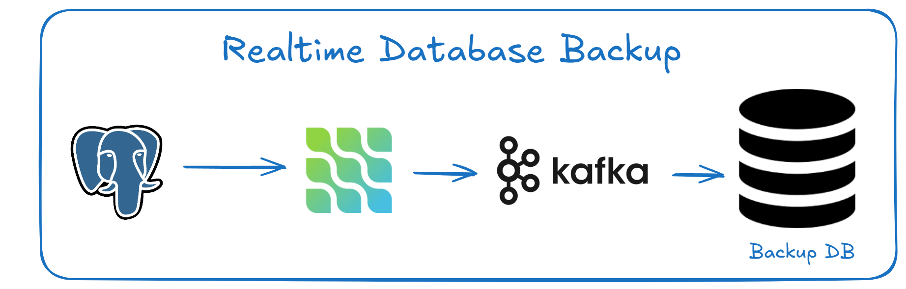

# Realtime DB Backup

## Steps

1. **Compose Kafka Container**
    - Set up and run the Kafka container using Docker Compose.
3. **Setup Postgres**
    - Change `wal_level = logical`
2. **Create Connector**
    - Use the POST API to create a connector with the following JSON body format:
      ```json
      {
        "name": "db-test",
        "config": {
            "connector.class": "io.debezium.connector.postgresql.PostgresConnector",
            "database.hostname": "postgres_container",
            "database.port": "5432",
            "database.user": "admin",
            "database.password": "admin",
            "database.dbname": "test_database",
            "plugin.name": "pgoutput",
            "database.server.name": "source",
            "key.converter.schemas.enable": "false",
            "value.converter.schemas.enable": "false",
            "transforms": "unwrap",
            "transforms.unwrap.type": "io.debezium.transforms.ExtractNewRecordState",
            "value.converter": "org.apache.kafka.connect.json.JsonConverter",
            "key.converter": "org.apache.kafka.connect.json.JsonConverter",
            "table.include.list": "public.dummy_data",
            "slot.name": "dbz_test"
        }
      }
      ```

3. **Get List of Connectors**
    - Use the appropriate API endpoint to retrieve the list of connectors.
    ```
    http://localhost:8083/connectors
    ```

4. **Delete Connectors**
    - Use the DELETE API to remove a connector by specifying its name in the URL:
    ```
    http://localhost:8083/connectors/{connector_name}
    ```